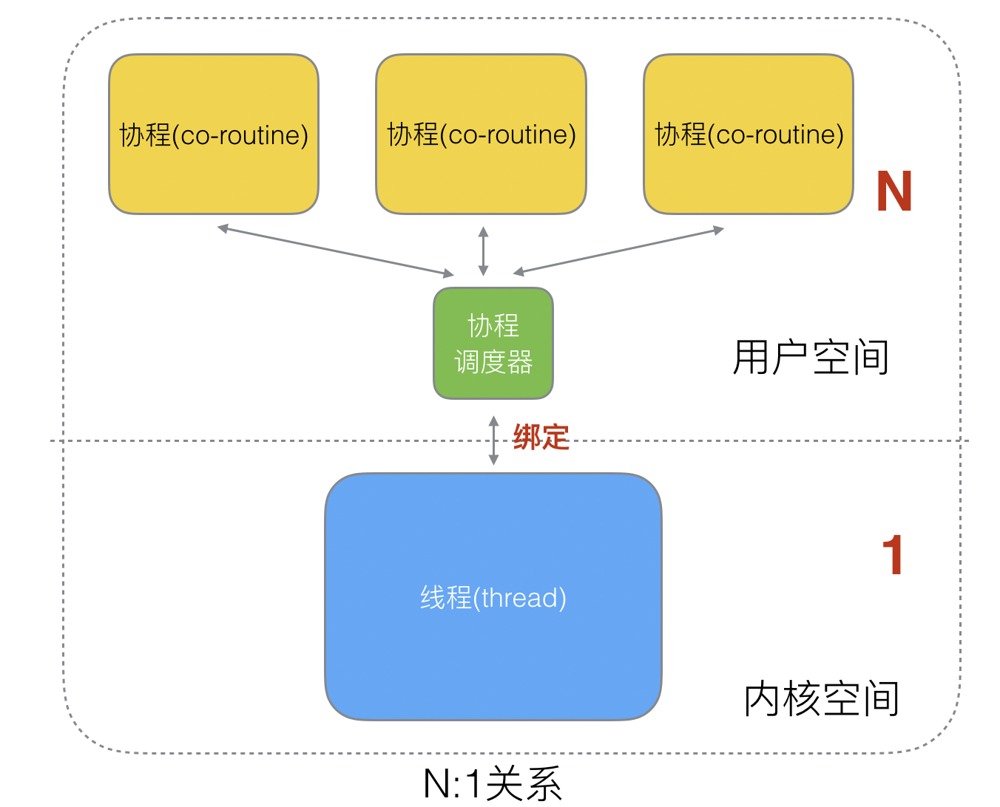
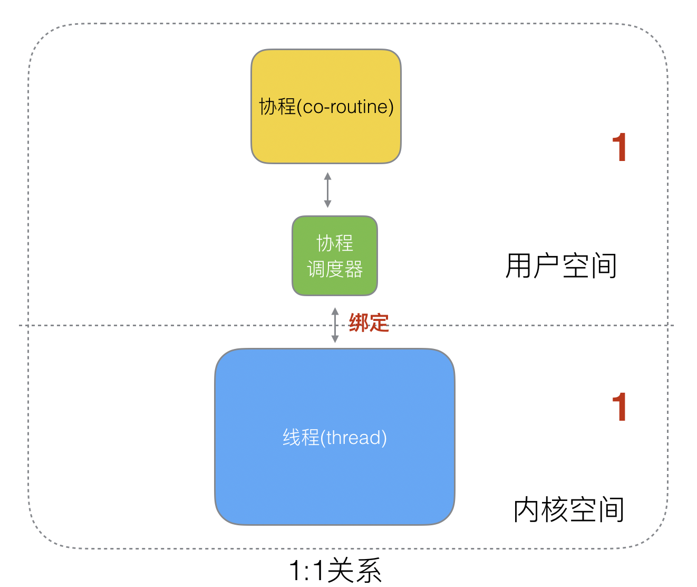

`# Golang的协程调度器原理及GMP设计思想？

## 一 、调度器
-- -
* 单线程时代不需要调度器
* 多进程/线程时代有了调度器需求
### 1.协程来提高CPU利用率
* 大量的进程/线程出现了新的问题
  * 高内存占用
  *   调度的高消耗CPU
####  1.1 3种协程和线程的映射关系：
**N:1关系**
N个协程绑定1个线程，优点就是**协程在用户态线程即完成切换**，不会陷入到内核态
，这种切换非常的轻量快速。但也有很大的缺点，1个进程的所有协程都绑定在1个线程上
* 缺点 
  * 某个程序用不了硬件的多核加速能力
  * 一旦某协程阻塞，造成线程阻塞，本进程的其他协程都无法执行了，根本就没有并发的能力了。

**1:1 关系**
1个协程绑定1个线程，这种最容易实现。协程的调度都由CPU完成了，不存在N:1缺点
* 缺点：
  * 协程的创建、删除和切换的代价都由CPU完成，有点略显昂贵了。

**M:N关系**
M个协程绑定1个线程，是N:1和1:1类型的结合，克服了以上2种模型的缺点，但实现起来最为复杂。

### 2 Go语言的协程goroutine

Go为了提供更容易使用的并发方法，使用了**goroutine**和**channel**。goroutine来自协程的概念，
让一组可复用的函数运行在一组线程之上，即使有协程阻塞，该线程的其他协程也可以被runtime
调度，转移到其他可运行的线程上。最关键的是，程序员看不到这些底层的细节，这就降低了编
程的难度，提供了更容易的并发。

Go中，协程被称为goroutine，它非常轻量，一个goroutine只占几KB,虽然一个goroutine的栈只占几KB，
但实际是可伸缩的，如果需要更多内容，runtime会自动为goroutine分配。

Goroutine特点：

* 占用内存更小（几kb）
* 调度更灵活(runtime调度)

### 3 被废弃的goroutine调度器
废弃的调度器MG，M表示线程，G表示协程

M想要执行、放回G都必须访问全局G队列，并且M有多个，
即多线程访问同一资源需要加锁进行保证互斥/同步，所以全局G队列是有互斥锁进行保护的。

老调度器的缺点：
* 创建，销毁，调度G都需要每个M获取锁，会形成激烈的锁竞争
* M转移G会造成延迟和额外的系统负载。比如当G中包含创建新协程的时候，M创建了G’，为了继续执行G，
需要把G’交给M’执行，也造成了很差的局部性，因为G’和G是相关的，最好放在M上执行，而不是其他M'。
* 系统调用(CPU在M之间的切换)导致频繁的线程阻塞和取消阻塞操作增加了系统开销。

## 二、Goroutine调度器的GMP模型的设计思想
- --
## 三、Go调度器调度场景过程全解析
-- -`
