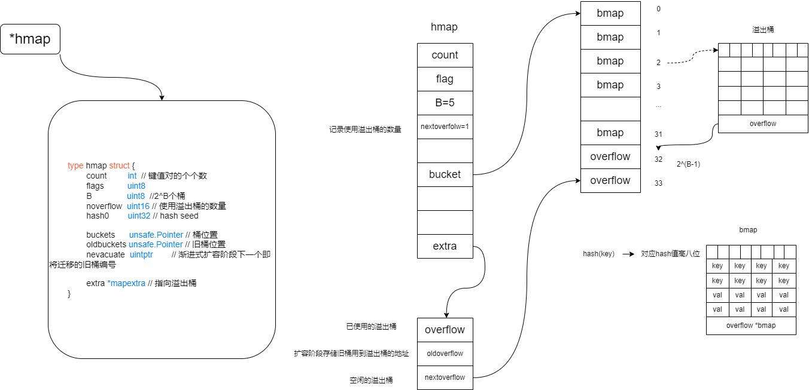

### map
* 取模法
* 与运算法
* 开放地址法
* 拉链法
* 负载因子 

    * 默认为6.5 超这个数会触发翻倍扩容 
* 渐进式扩容
* 溢出桶 为减少扩容次数
* 扩容
  * 负载因子   * count/2^B >6.5 **翻倍扩容**
  * 负载因子没有超标，使用溢出桶较多会触发**等量扩容** 、等量扩容桶可以让键值对排列更紧密
    * B<=15 noverflow>=2^B
    * b>15  noverflow>=2^15
 
```go


type hmap struct {
	count     int  // 键值对的个个数
	flags     uint8
	B         uint8  //2^B个桶
	noverflow uint16 // 使用溢出桶的数量
	hash0     uint32 // hash seed

	buckets    unsafe.Pointer // 桶位置
	oldbuckets unsafe.Pointer // 旧桶位置
	nevacuate  uintptr        // 渐进式扩容阶段下一个即将迁移的旧桶编号 

	extra *mapextra // 指向溢出桶
}
type mapextra struct {
    
    overflow    *[]*bmap  //已使用溢出桶的地址
    oldoverflow *[]*bmap  //旧桶已使用溢出桶的地址
    nextOverflow *bmap //指向下一个空闲溢出桶
}
type bmap struct {
    tophash [bucketCnt]uint8 //对应hash值的高八位

}
```

