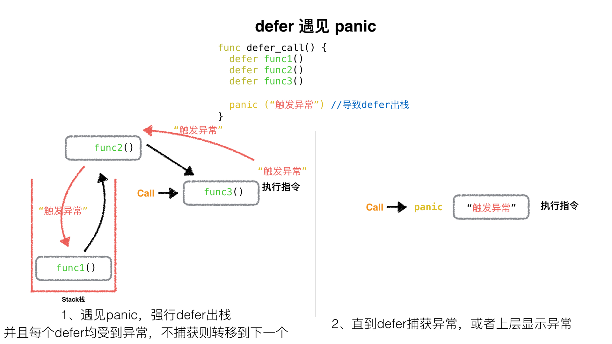

## defer 七个知识点
### 1.defer的执行顺序

当有多个defer出现时，他是一个**栈**操作，即先进后出，写在前边的defer调用的比卸载后边的defer晚。

### 2.return之后的语句先执行，defer后的语句后执行

### 3.函数的返回值初始化
只要声明函数的返回值变量名称，就会在函数初始化时候为之赋值为0，而且在函数体作用域可见。

### 4.有名函数返回值遇见defer情况
我们通过知识点2得知，先return，再defer，所以在执行完return之后，还要再执行defer里的语句，依然可以修改本应该返回的结果。

### 5.defer遇到panic
能够触发defer的是遇见return(或函数体到末尾)和遇见panic。

* 遇到panic时，遍历本协程的defer链表，并执行defer。
* 在执行defer过程中:遇到recover则停止panic，返回recover处继续往下执行。
* 如果没有遇到recover，遍历完本协程的defer链表后，向stderr抛出panic信息。



**defer 最大的功能是 panic 后依然有效** 所以defer可以保证你的一些资源一定会被关闭，从而避免一些异常出现的问题。
### 6. defer中包含panic
**panic仅有最后一个可以被recover捕获。**

```go
package main

import (
	"fmt"
)

func main()  {

	defer func() {
		if err := recover(); err != nil{
			fmt.Println(err)
		}else {
			fmt.Println("fatal")
		}
	}()

	defer func() {
		panic("defer panic")
	}()

	panic("panic")
}
```
```
# 结果
defer panic
```
* 触发panic("panic")后defer顺序出栈执行，第一个被执行的defer中 会有panic("defer panic")异常语句
* 这个异常将会覆盖掉main中的异常panic("panic")，最后这个异常被第二个执行的defer捕获到。

### 7. defer下的函数参数包含子函数
```go
package main

import "fmt"

func function(index int, value int) int {

    fmt.Println(index)

    return index
}

func main() {
    defer function(1, function(3, 0))
    defer function(2, function(4, 0))
}
```
* defer压栈function1，压栈函数地址、形参1、形参2(调用function3) --> 打印3
* defer压栈function2，压栈函数地址、形参1、形参2(调用function4) --> 打印4
* defer出栈function2, 调用function2 --> 打印2
* defer出栈function1, 调用function1--> 打印1