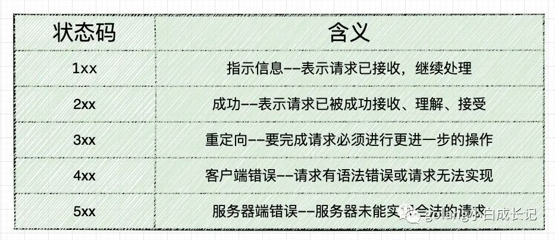

### HTTP

#### 1.什么是HTTP

#### 2.URL和URI
* URL 统一资源定位符
* URI 统一资源标识符

#### 3.请求方法 
* GET
* POST
* DELETE
* PUT
* HEAD
  * 判断某个资源是否存在，相比于GET省下拿body的消耗
  * 如果请求的是一个比较大的资源，比如一个超大视频和文件，你只想知道它到底有多大，
  而不需要整个下载下来，这时候使用HEAD请求，返回的headers会带有文件的大小（content-length）

#####  3.5 OPTIONS
* options是什么
* 什么时候需要使用options
* 什么是简单请求和复杂请求。
* 什么是跨域
* 如何优化options

#### 4.状态码

* 101
* 206
* 200
* 401
* 404
* 500
#### 5.Headers

* Content-Length  是HTTP的消息长度, 用十进制数字表示。指出报文中消息的当前实际字节大小
* Range 用于指定要请求文件的起始和结束位置
  * Connection 长连接和短连接
    * Connection: close 表示请求响应完成之后立即关闭连接，这是HTTP/1.0请求的默认值。
    每次请求都经过“创建tcp连接 -> 请求资源 -> 响应资源 -> 释放连接”这样的过程
    * Connection: keep-alive 表示连接不立即关闭，可以继续响应下一个请求。HTTP/1.1的请
    求默认使用一个持久连接。可以做到只建立一次连接，多次资源请求都复用该连接，完成后关闭。
    流程上是 建立tcp连接 -> 请求资源 -> 响应资源 -> … （保持连接）…  ->  第n次请求资源 -> 第n次响应资源 -> 释放连接。

**问：HTTP为什么要使用长连接**
  HTTP协议建立在TCP协议之上，TCP建立连接需要三次握手，释放连接需要四次挥手，这些时间步需要时间，会给http请求带来
时延，如果使用短短连接，TCP每次收到http请求都需要建立连接，响应后关闭连接，如果使用长连接就可以建立一次连接，处理多次
http请求，**可以减少资源浪费，节约时间，**对于提升HTTP性能有很大的帮助。

####  6.Cookies
####  7.Referrer Policy 和 Referrer
####  8.Cache-control
####  9.ETag

