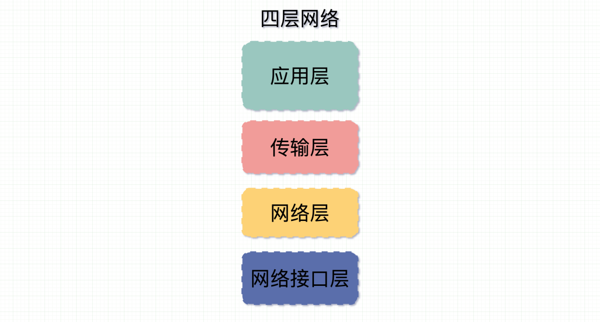

# TCP 粘包

TCP/IP四层网络协议
* 应用层 
* 传输层
* 网络层
* 数据链路层

os七层网络协议
* 应用层
* 表示层
* 会话层
* 传输层
* 网络层
* 数据链路层
* 物理层

**MTU**和**MSS**有什么区别
* MTU：Maximum Transmit Unit 是最大传输单元，一般 MTU=1500 Byte。由**数据链路层**提供给**网络层**最大一次传输数据的大小；
* MSS: Maximum Segment Size  TCP 提交给 IP 层最大分段大小,。TCP 提交给 IP 层最大分段大小，不包含 TCP Header 和  TCP Option，
只包含 TCP Payload ，MSS 是 TCP 用来限制应用层最大的发送字节数。

  
### 问题1：TCP为什么会发生粘包？怎么解决这个问题
* 首先说下TCP，传输控制协议，是**面向连接**的，**可靠**的传输协议，**基于字节流**传输层通信协议
* 基于字节流，消息被切分成各种数据包，接收端拿到这些数据包后不能正确还原出数据，因此出现**粘包**的现象
* Nagle算法，这个算法是为了避免发送比较小的数据包，浪费资源，但引起了粘包问题
* 粘包问题的根本原因是**不确定的消息边界**，解决方法
  * 加入特殊标志位，未避免标志位和数据相同，可以加入校验字段放在标志位后
  * 加入消息长度

### 问题2：UDP会发生粘包吗？为什么
* UDP，用于数据包协议，是面向无连接的，不可靠的，基于**数据报**的传输层通信协议
* UDP不会粘包
* 基于**数据报**指应用层无论发出多大的数据报，UDP都会一次发送一个报文，既不合并，也不拆分，而是保留这些报文的边界。
* 

### 问题3：IP会发生粘包吗？为什么
* 不会，粘包其实是由于使用者无法正确区分消息边界导致的一个问题。
* 如果消息过长，IP层会按 MTU 长度把消息分成 N 个切片，每个切片带有自身在包里的位置（offset）和同样的IP头信息。
* 各个切片在网络中进行传输。在最后的终点汇合后再组装。
* 在接收端收到第一个切片包时会申请一块新内存，创建IP包的数据结构，等待其他切片分包数据到位。
* 等消息全部到位后就把整个消息包给到上层（传输层）进行处理。
